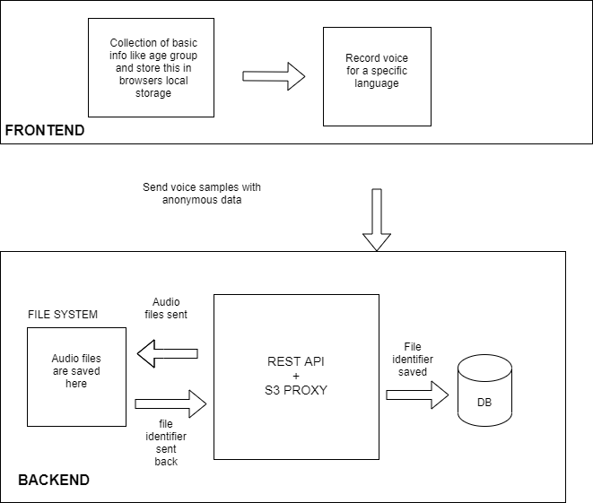

# Finidings of S3proxy team 2019 internship

## Tasks

- Stabilizing and debugging the Swecha voice project.
- Figuring out the complete Architecture.
- S3proxy implemenation and other information.
- Feasibility of Non-docker implementation of S3proxy.
- Checking the possibility of node environment implementation of web.
- Finding where collected clips are stored.
- Resolve some configuration related bugs of MYSQL.
- Changing format of clips being stored from ".mp3" to ".wav".

---

## Stabilizing and debugging the Swecha voice project.

We tried to execute the [old version](https://code.swecha.org/localization-2.0/voice-web)
Some of the modules like mysql, db-migrate, mini-export-css-plugin, and many other npm modules throws errors.
Updating those npm modules breaking the project.

Proposal of new common voice version as a base of the project.
It was unlikely to stabilize the project. So, we planned to move to the new version.
Which has been accepted and we are working on.
New Implementation - [Goto_Speech-project](https://code.swecha.org/AssistiveTech/swecha-voice/speech-project/-/tree/develop)

---

## Figuring out the complete Architecture.



---

## Feasibility of Non-docker implementation of S3proxy

As we need S3 proxy to localize the application and S3proxy is written in java we need to set up a maven environment to run the application through terminal and difficult to handle and we are working on node and docker environment so it is more feasible and easy to make it fully dockerized. It provides environment stability and we can easily add any new dependencies.
**PS for windows users**
If you encounter `/usr/bin/env: 'bash\r': No such file or directory` this error while setting up the full dockerized implementation try following these steps:
To make Git check out files with Unix-style file endings on Windows use :
`git config --global core.autocrlf false`
Then run installation commands involving git clone command.
To restore Git’s behaviour later run :
`git config --global core.autocrlf true`

---

## S3proxy implemenation and other information.

Proxy Server is a computer that acts as a gateway between local network and large-scale network such as the internet, may also cache websites and thereby increase performance. S3Proxy implements the S3 API and proxies requests enabling testing without S3 storage by using a local filesystem. The approach is to use [S3proxy docker image](https://hub.docker.com/r/andrewgaul/s3proxy/) provided by [Andrew Gaul](https://github.com/gaul) . This docker image is capable of handling the disk storage functionality. So this fulfills the purpose of functionality we are looking for.
This communicates with the existing aws code which sends the request to S3 storage this S3 proxy will capture those requests and performs data manipulation and other activities local storage acting as proxy.
Then test the functionality. The other way is to use the Java S3 proxy module and use maven to run it through the terminal . This will not be a comfortable way as it needs more supervision and non proper handling of local storage.Swecha voice has s3 proxy image integrated with it so, we don’t need to pull the image and set it up separately.

---

## Docker

Normal Setup of the speech-project.

```sh
cd speech-project
docker-compose up --build --force-recreate
```

---

## Finding where collected clips are stored.

From our analysis and traceback. We found that these collected clips are stored in S3proxy volume.
To access them open docker terminal and follow the commands.

```sh
mysql -u voicecommons -p
cd data
cd common-voice-clips
ls
<!--(folder output from ls)-->
cd folder
ls
<!--(returns all the voice clips.)-->
```

And these clips paths are stored in mysql database.

## Checking the possibility of node environment implementation of web.

## Setup:

Change docker-compose.yaml to

```sh
version: '3'
services:
  db:
    image: mysql:5.7.28
    ports:
       - '3306:3306'
    container_name: db
    restart: unless-stopped
    environment:
      - MYSQL_DATABASE=voiceweb
      - MYSQL_USER=voicecommons
      - MYSQL_PASSWORD=voicecommons
      - MYSQL_ROOT_PASSWORD=voicewebroot
    command: mysqld --sql_mode="STRICT_TRANS_TABLES,NO_ZERO_IN_DATE,NO_ZERO_DATE,ERROR_FOR_DIVISION_BY_ZERO,NO_AUTO_CREATE_USER,NO_ENGINE_SUBSTITUTION"
  s3proxy:
    image: andrewgaul/s3proxy
    container_name: s3proxy
    ports:
      - '100:8050'
    environment:
      - S3PROXY_AUTHORIZATION=none
networks:
  voice-web:

```

Run this terminal command for set variable of process.env

```sh
export DOTENV_CONFIG_PATH=/Users/usr_name/project_location/.env-local-docker
```

Create a config.json and add these attributes

```sh
{
    "IMPORT_SENTENCES": true,
    "MYSQLDBNAME": "voiceweb",
    "MYSQLUSER": "voicecommons",
    "MYSQLPASS": "voicecommons",
    "MYSQLHOST": "127.0.0.1"
}
```

> Here we are avoid docker implementaion of web and focusing on docker implementation of Database and S3proxy.
> Here we are mapping docker ports to localhost ports where docker port 3306 is mapped to localhost 3306, docker port 100 is mapped to localhost 8050.

```sh
web         | wait-for-it.sh: S3proxy80 is avaliable in 3 seconds
Web         | checking if S3 bucket exists...
Web         | GET bucket code:  404
web         | Bucket does not exist. Creating one...
web         | PUT bucket Code:200
Web         | Done!
```

> This means that we cannot create local bucket and implement local storage without using docker implementation of web.

```sh
NoSuchBucket: The specified bucket does not exist
[BE]     at Request.extractError (/Users/usr_name/Desktop/speech-project/node_modules/aws-sdk/lib/services/s3.js:816:35)
[BE]     at Request.callListeners (/Users/usr_name/Desktop/speech-project/node_modules/aws-sdk/lib/sequential_executor.js:106:20)
[BE]     at Request.emit (/Users/usr_name/Desktop/speech-project/node_modules/aws-sdk/lib/sequential_executor.js:78:10)
[BE]     at Request.emit (/Users/usr_name/Desktop/speech-project/node_modules/aws-sdk/lib/request.js:683:14)
[BE]     at Request.transition (/Users/usr_name/Desktop/speech-project/node_modules/aws-sdk/lib/request.js:22:10)
[BE]     at AcceptorStateMachine.runTo (/Users/usr_name/Desktop/speech-project/node_modules/aws-sdk/lib/state_machine.js:14:12)
[BE]     at /Users/usr_name/Desktop/speech-project/node_modules/aws-sdk/lib/state_machine.js:26:10
[BE]     at Request.<anonymous> (/Users/usr_name/Desktop/speech-project/node_modules/aws-sdk/lib/request.js:38:9)
[BE]     at Request.<anonymous> (/Users/usr_name/Desktop/speech-project/node_modules/aws-sdk/lib/request.js:685:12)
[BE]     at Request.callListeners (/Users/usr_name/Desktop/speech-project/node_modules/aws-sdk/lib/sequential_executor.js:116:18)
[BE]     at Request.emit (/Users/usr_name/Desktop/speech-project/node_modules/aws-sdk/lib/sequential_executor.js:78:10)
[BE]     at Request.emit (/Users/usr_name/Desktop/speech-project/node_modules/aws-sdk/lib/request.js:683:14)
[BE]     at Request.transition (/Users/usr_name/Desktop/speech-project/node_modules/aws-sdk/lib/request.js:22:10)
[BE]     at AcceptorStateMachine.runTo (/Users/usr_name/Desktop/speech-project/node_modules/aws-sdk/lib/state_machine.js:14:12)
[BE]     at /Users/usr_name/Desktop/speech-project/node_modules/aws-sdk/lib/state_machine.js:26:10
[BE]     at Request.<anonymous> (/Users/usr_name/Desktop/speech-project/node_modules/aws-sdk/lib/request.js:38:9)
```

> implementing the web node evnvirroment with simultaneous dockerized database and S3proxy will lead this where it is seeking the S3 credentails and S3 proxy is not receiving the requests.
> So eventually you need to add S3Configuration.

S3 configuration
[HOWTO_S3.md](https://code.swecha.org/AssistiveTech/swecha-voice/speech-project/-/blob/develop/docs/HOWTO_S3.md)

---

# Resolve some configuration-related bugs of MYSQL

The problem is it is not connecting to the desired database and to find what is preventing that to happen we need to look at logs and print new logs to console and it is very important to add these logs at correct positions to find out what exactly is going wrong inorder to debug the application.

While working with previous versions we have encountered some errors in :
**config-helper.js**
**mysql.ts**
**main.ts**
So to trace back where we the errors are occurring we have log them using the function console.log()

In **config-helper.js** we have added `console.log(BASE_CONFIG)` before try catch block

```
console.log(BASE_CONFIG )
  try {
    let config_path = process.env.SERVER_CONFIG_PATH || './config.json';
    fileConfig = JSON.parse(fs.readFileSync(config_path, 'utf-8'));
  } catch (err) {
    console.error(
      `Could not load config.json, using defaults (error message: ${err.message})`
    );
  }
```

In **mysql.ts** we added `console.log()` to getConnections function in order to find out to which database it is connecting

```
async getConnection(options: MysqlOptions): Promise<IConnection> {
  console.log(options);
  return mysql2.createConnection(options);
}
```

In **main.ts**

```
console.log(process.env);
```

After checking these logs obtained from previous changes in config files we had set the `root_pass` and `mysqlhost` in `.env-local-docker` accordingly.

---

## Changing format of clips data being stored from ".mp3" to ".wav".

We have to make channges so that the data is stored loss format like ".wav" but its currently storing it as ".mp3" format so we find out processing that being done and then we removes the stream-coder and its functions which is processing the data to ".mp3" format and changed so it collects the raw audio and saves it in ".wav" format to extract the clips that were being stored in docker volume we created a bind mount so new incoming clips are shown in filesystem of the computer we then looked at clips they are being stored in .wav format and everything working perfectly fine.Without bind mount we are not able interact with the files in docker volume.

---

## S3proxy References

| Plugin       | README                                                     |
| ------------ | ---------------------------------------------------------- |
| Docker-Image | [Docker-Hub](https://hub.docker.com/r/andrewgaul/s3proxy/) |
| Zip(module)  | [Github](https://github.com/gaul/s3proxy/releases)         |

---

## Issues Resolved

| Issues                                                                        |
| ----------------------------------------------------------------------------- |
| https://code.swecha.org/AssistiveTech/swecha-voice/speech-project/-/issues/19 |
| https://code.swecha.org/AssistiveTech/swecha-voice/speech-project/-/issues/20 |
| https://code.swecha.org/AssistiveTech/swecha-voice/speech-project/-/issues/21 |
| https://code.swecha.org/AssistiveTech/swecha-voice/speech-project/-/issues/22 |
| https://code.swecha.org/AssistiveTech/swecha-voice/speech-project/-/issues/23 |
| https://code.swecha.org/AssistiveTech/swecha-voice/speech-project/-/issues/24 |
| https://code.swecha.org/AssistiveTech/swecha-voice/speech-project/-/issues/26 |
| https://code.swecha.org/AssistiveTech/swecha-voice/speech-project/-/issues/27 |
| https://code.swecha.org/AssistiveTech/swecha-voice/speech-project/-/issues/30 |

---

## Merge Requests

| Merge Requests                                                                        |
| ------------------------------------------------------------------------------------- |
| https://code.swecha.org/AssistiveTech/swecha-voice/speech-project/-/merge_requests/35 |
| https://code.swecha.org/AssistiveTech/swecha-voice/speech-project/-/merge_requests/27 |
| https://code.swecha.org/AssistiveTech/swecha-voice/speech-project/-/merge_requests/41 |
| https://code.swecha.org/AssistiveTech/swecha-voice/speech-project/-/merge_requests/43 |

---

## Contributors

| NAME                     | Role              |
| ------------------------ | ----------------- |
| Saibaba Alapati          | Teamlead & Tester |
| Sreekar venkata Nulapati | Teamlead & Tester |
| Karthik Reddy            | Tester            |
| Ahyana Childvilas        | Tester            |
| Akshat Singh             | Tester            |
| Tushar                   | Tester            |
| Aditya                   | Tester            |
